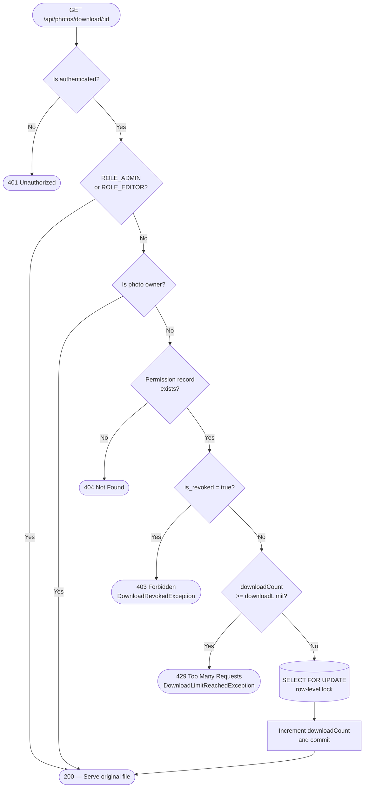

# Photo Archive


A production-ready REST API for managing a photographic archive.
Core value proposition: **Atomic Permission & Revocation** — every download of a
third-party image is gated by a per-user, per-photo permission record whose
counter is incremented atomically via a `SELECT … FOR UPDATE` row lock,
making it impossible for concurrent requests to exceed the authorised limit
even under high-frequency load.

---

## Table of Contents

1. [Architecture Overview](#1-architecture-overview)
2. [Tech Stack & Prerequisites](#2-tech-stack--prerequisites)
3. [Getting Started](#3-getting-started)
4. [Configuration Reference](#4-configuration-reference)
5. [API Reference](#5-api-reference)
6. [Security Model](#6-security-model)
7. [Download Authorization Flow](#7-download-authorization-flow)
8. [Development & Testing](#8-development--testing)
9. [Observability](#9-observability)
10. [Governance](#10-governance)

---

## 1. Architecture Overview

```
┌──────────────────────────────────────────────────────────────┐
│                        REST Clients                          │
└───────────────────────────┬──────────────────────────────────┘
                            │ HTTPS
                            ▼
┌──────────────────────────────────────────────────────────────┐
│  Spring Security Filter Chain                                │
│  AuthTokenFilter → JWT validation → SecurityContext          │
└───────────────────────────┬──────────────────────────────────┘
                            │
          ┌─────────────────┼─────────────────┐
          ▼                 ▼                 ▼
    PhotoController  DownloadPermission  UserAdminController
    AuthController    Controller         ...other controllers
          │                 │
          ▼                 ▼
    PhotoService     DownloadPermissionService  (PESSIMISTIC_WRITE)
    AuthService      PhotoEventTrackService
          │                 │
          ▼                 ▼
    FileStorageServiceImpl  ImageServiceImpl  MetadataServiceImpl
    (local disk, date-      (Thumbnailator)   (metadata-extractor)
     partitioned layout)
          │
          ▼
    MySQL via Spring Data JPA / Hibernate
```

### Dual Storage Layout

Every uploaded image is stored in two parallel paths under the configured
upload directory:

```
{upload-dir}/
└── {YYYY}/
    └── {MM}/
        ├── photos/        ← original high-resolution file
        └── thumbnails/    ← web-optimised JPEG (max 1280×1280, q=0.8)
```

The database stores both relative paths. The `view` endpoint serves the
thumbnail; the `download` endpoint (after permission validation) serves the
original.

### Exception Mapping

All exceptions are translated to structured JSON by `GlobalExceptionHandler`:

| Exception                        | HTTP Status                   |
|----------------------------------|-------------------------------|
| `EntityNotFoundException`        | `404 Not Found`               |
| `MethodArgumentNotValidException` | `400 Bad Request`            |
| `IllegalArgumentException`       | `400 Bad Request`             |
| `IllegalStateException`          | `400 Bad Request`             |
| `FileStorageException`           | `500 Internal Server Error`   |
| `AccessDeniedException`          | `403 Forbidden`               |
| `DownloadRevokedException`       | `403 Forbidden`               |
| `DownloadLimitReachedException`  | `429 Too Many Requests`       |
| `RuntimeException` (fallback)    | `409 Conflict`                |

Error response body:

```json
{
  "timestamp": "2026-03-15T14:32:00",
  "status": 404,
  "error": "Not Found",
  "message": "Photo with id 99 was not found.",
  "details": null
}
```

---

## 2. Tech Stack & Prerequisites

### Runtime Dependencies

| Dependency                      | Version         | Purpose                                    |
|---------------------------------|-----------------|--------------------------------------------|
| Spring Boot                     | 4.0.3           | Application framework                      |
| Spring Data JPA / Hibernate     | (Boot-managed)  | ORM and repository layer                   |
| Spring Security                 | (Boot-managed)  | Authentication and authorisation           |
| Spring Validation               | (Boot-managed)  | Bean Validation (Jakarta EE)               |
| MySQL Connector/J               | (Boot-managed)  | JDBC driver                                |
| jjwt-api / impl / jackson       | 0.11.5          | JWT creation and verification              |
| metadata-extractor              | 2.19.0          | EXIF / IPTC metadata parsing               |
| Thumbnailator                   | 0.4.20          | Web-optimised image generation             |
| Lombok                          | (Boot-managed)  | Boilerplate reduction (compile-only)       |

### Infrastructure Requirements

| Component | Minimum Version | Notes                               |
|-----------|-----------------|-------------------------------------|
| JDK       | 17              | LTS; Java 21 also supported         |
| Maven     | 3.8+            | Or use the included `./mvnw`        |
| MySQL     | 8.0+            | Schema is auto-managed by Hibernate |

---

## 3. Getting Started

```bash
# 1. Clone the repository
git clone <repo-url>
cd photo-archive

# 2. Create the database (schema is auto-created by Hibernate on first run)
mysql -u root -p -e "CREATE DATABASE IF NOT EXISTS photoarchive_db;"

# 3. Configure credentials — do NOT edit application.properties for secrets.
#    Set environment variables instead (see Section 4):
export SPRING_DATASOURCE_PASSWORD=your_db_password
export PHOTOARCHIVE_JWT_SECRET=your_256bit_hex_secret

# 4. Run the application
./mvnw spring-boot:run

# The API is available at http://localhost:8080
```

---

## 4. Configuration Reference

All properties live in `src/main/resources/application.properties`.
**Never commit real credentials.** Override sensitive values with environment
variables or an external secrets manager.

| Property | Default | Sensitive | Description |
|---|---|:---:|---|
| `spring.datasource.url` | `jdbc:mysql://localhost:3306/photoarchive_db` | | JDBC connection URL |
| `spring.datasource.username` | `root` | | Database user |
| `spring.datasource.password` | *(empty)* | **YES** | Database password — use env var `SPRING_DATASOURCE_PASSWORD` |
| `spring.jpa.hibernate.ddl-auto` | `update` | | Schema strategy; use `validate` in production |
| `spring.jpa.show-sql` | `true` | | Set to `false` in production to reduce log noise |
| `photoarchive.app.jwtSecret` | *(hex string)* | **YES** | HS256 signing key — use env var `PHOTOARCHIVE_JWT_SECRET` |
| `photoarchive.app.jwtExpirationMs` | `86400000` | | Token TTL in milliseconds (default: 24 h) |
| `photoarchive.app.upload-dir` | `uploads` | | Root directory for all uploaded files |
| `photoarchive.app.photo-visibility` | `PRIVATE` | | `PUBLIC` opens view/search to anonymous users; `PRIVATE` requires authentication |
| `spring.servlet.multipart.max-file-size` | `50MB` | | Maximum size per uploaded file |
| `spring.servlet.multipart.max-request-size` | `55MB` | | Maximum total multipart request size |

### Recommended Production Overrides

```properties
spring.jpa.hibernate.ddl-auto=validate
spring.jpa.show-sql=false
photoarchive.app.photo-visibility=PRIVATE
```

---

## 5. API Reference

### Authentication — `/api/auth`

| Method | Endpoint | Required Role | Request Body | Business Rule |
|--------|----------|:-------------:|--------------|---------------|
| `POST` | `/api/auth/signin` | Public | `{"username":"alice","password":"secret"}` | Returns a signed JWT valid for `jwtExpirationMs` ms |
| `POST` | `/api/auth/signup` | Public | `{"username":"alice","email":"a@b.com","password":"secret123"}` | Registers with `ROLE_USER`; rejects duplicate username or e-mail |

### Photos — `/api/photos`

| Method | Endpoint | Required Role | Payload / Params | Business Rule |
|--------|----------|:-------------:|------------------|---------------|
| `GET` | `/api/photos/view/**` | Public or Auth* | Path suffix = `webOptimizedPath` | Serves thumbnail inline; `410 Gone` for inactive photos |
| `GET` | `/api/photos/download/{photoId}` | Authenticated | — | Runs the 3-tier permission guard; increments counter atomically |
| `POST` | `/api/photos/upload` | ADMIN, EDITOR, AUTHOR | Multipart: `file`, `title`, `categories` (id list), `artisticAuthorName` (opt) | Validates MIME type; extracts EXIF/IPTC; generates thumbnail |
| `PUT` | `/api/photos/{id}` | ADMIN, EDITOR, or Owner | `{"title":"…","active":true,"categoryIds":[1,2]}` | Partial update; non-null fields only |
| `DELETE` | `/api/photos/{id}` | ADMIN, EDITOR, or Owner | — | Soft delete: sets `active = false` |
| `GET` | `/api/photos/search` | Public or Auth* | `?keyword=bird&authorId=1&eventId=2&resultTypeId=3&page=0&size=20&sort=createdAt,desc` | Full-text across title + all EXIF/IPTC fields; paginated |

*Visibility controlled by `photoarchive.app.photo-visibility`.

### Download Permissions — `/api/downloads/permissions`

| Method | Endpoint | Required Role | Request Body / Params | Business Rule |
|--------|----------|:-------------:|-----------------------|---------------|
| `POST` | `/api/downloads/permissions` | Authenticated | `{"userId":5,"photoId":12,"downloadLimit":3}` | Upsert semantics; only ADMIN, EDITOR, or photo owner may grant |
| `DELETE` | `/api/downloads/permissions/{uuid}` | Authenticated | — | Sets `is_revoked = true`; only ADMIN, EDITOR, or photo owner may revoke |
| `GET` | `/api/downloads/permissions` | ADMIN, EDITOR | `?photoId=12` or `?userId=5` | Lists all permissions; `photoId` takes precedence over `userId` |

### Event Traceability — `/api/tracks`

| Method | Endpoint | Required Role | Request Body | Business Rule |
|--------|----------|:-------------:|--------------|---------------|
| `POST` | `/api/tracks` | ADMIN, EDITOR | `{"photoId":1,"eventId":2,"resultTypeId":3,"honor":"Gold Medal","notes":"…"}` | Photo must be active; throws `400` otherwise |
| `GET` | `/api/tracks/photo/{photoId}` | ADMIN, EDITOR, AUTHOR, GUEST | — | Full event history for a photo |
| `GET` | `/api/tracks/event/{eventId}` | ADMIN, EDITOR, AUTHOR, GUEST | — | All photo entries for an event |

### Events — `/api/events`

| Method | Endpoint | Required Role | Request Body | Business Rule |
|--------|----------|:-------------:|--------------|---------------|
| `GET` | `/api/events` | USER, ADMIN, EDITOR | — | Returns all events |
| `POST` | `/api/events` | ADMIN, EDITOR | `{"name":"FIAP 2025","type":"CONTEST","eventDate":"2025-11-20","city":"Porto","country":"PT"}` | `type` must be `CONTEST` or `EXHIBITION` |

### Categories — `/api/categories`

| Method | Endpoint | Required Role | Request Body | Business Rule |
|--------|----------|:-------------:|--------------|---------------|
| `GET` | `/api/categories` | Public | — | Returns all categories |
| `POST` | `/api/categories` | ADMIN | `{"name":"Monochrome"}` | Rejects duplicate names |

### Result Types — `/api/results`

| Method | Endpoint | Required Role | Request Body | Business Rule |
|--------|----------|:-------------:|--------------|---------------|
| `GET` | `/api/results` | USER, ADMIN, EDITOR | — | Returns all result types |
| `POST` | `/api/results` | ADMIN | `{"description":"1st Place"}` | Creates a new result type |

### User Administration — `/api/admin/users`

| Method | Endpoint | Required Role | Request Body / Params | Business Rule |
|--------|----------|:-------------:|-----------------------|---------------|
| `PUT` | `/api/admin/users/{id}/roles` | ADMIN | `["ROLE_EDITOR","ROLE_AUTHOR"]` | Replaces the entire role set |
| `PUT` | `/api/admin/users/{id}/status` | ADMIN | `?active=false` | Activates or deactivates an account |

---

## 6. Security Model

### Roles

| Role | Description |
|------|-------------|
| `ROLE_ADMIN` | Full access to all endpoints, including user administration |
| `ROLE_EDITOR` | Can manage photos, events, tracks, and download permissions |
| `ROLE_AUTHOR` | Can upload photos and manage their own content |
| `ROLE_GUEST` | Read-only access to tracks and event history |
| `ROLE_USER` | Default role assigned at registration |

All roles are stored in a `user_roles` join table and loaded lazily.
`UserDetailsServiceImpl` wraps `loadUserByUsername` in a `@Transactional`
boundary to ensure the lazy collection is initialised before the JPA session
closes.

### Ownership Checks

`PhotoService.isOwner(username, photoId)` is called via Spring EL directly
in `@PreAuthorize` on `PUT /api/photos/{id}` and `DELETE /api/photos/{id}`,
so non-owner, non-editor users are rejected at the filter chain level before
the service method is invoked.

Fine-grained checks for the download permission system (grant and revoke)
are enforced inside `DownloadPermissionService` rather than in the controller
to keep the controller thin and avoid a redundant DB round-trip.

---

## 7. Download Authorization Flow



### Concurrency Guarantee

`DownloadPermissionRepository.findByUserIdAndPhotoIdWithLock` is annotated
with `@Lock(LockModeType.PESSIMISTIC_WRITE)`, which translates to
`SELECT … FOR UPDATE` in MySQL. This serialises all concurrent download
requests for the same `(userId, photoId)` pair at the database level,
preventing two threads from simultaneously reading a stale counter and
both deciding they are within the limit before either has incremented it.

---

## 8. Development & Testing

### Running the Application

```bash
./mvnw spring-boot:run
```

### Running Tests

```bash
# All tests
./mvnw test

# Single test class
./mvnw test -Dtest=DownloadPermissionServiceTest
```

### Test Coverage Summary

| Test Class | Layer | What it covers |
|---|---|---|
| `PhotoArchiveApplicationTests` | Integration | Spring context loads without errors |
| `DownloadPermissionServiceTest` | Unit (Service) | All three precedence levels, revocation, limit exhaustion, and concurrent-increment safety |

> **Note:** Swagger / OpenAPI is not included in the current `pom.xml`.
> To add it, include `springdoc-openapi-starter-webmvc-ui` and access
> the UI at `http://localhost:8080/swagger-ui.html`.

### Code Style

The project follows the **Google Java Style Guide**. Key conventions:

- Third-person singular present indicative for all Javadoc method summaries.
- `@param`, `@return`, and `@throws` on every public method.
- Actionable exception messages: `[Problem] + [Reason] + [Fix/Instruction]`.
- No noise comments; business-decision comments are kept and written in en_US.

---

## 9. Observability

### Logging

The project uses **SLF4J** with the Spring Boot default backend (Logback).
All log messages use `{}` placeholders — string concatenation is never used
in log statements.

Key log points:

| Level | Class | Event |
|-------|-------|-------|
| `WARN` | `MetadataServiceImpl` | `Metadata extraction failed for '{}': {}. The file will be stored without EXIF/IPTC data.` |
| `ERROR` | `AuthEntryPointJwt` | Unauthorized access attempt on a protected endpoint |

### Kill Switch — Revoking a Download Permission

To immediately cut off a user's download access for a specific photo:

```bash
# 1. Obtain an admin JWT
TOKEN=$(curl -s -X POST http://localhost:8080/api/auth/signin \
  -H "Content-Type: application/json" \
  -d '{"username":"admin","password":"adminpass"}' | jq -r '.accessToken')

# 2. Find the permission UUID (filter by photoId or userId)
PERMISSION_ID=$(curl -s \
  -H "Authorization: Bearer $TOKEN" \
  "http://localhost:8080/api/downloads/permissions?photoId=12" \
  | jq -r '.[0].id')

# 3. Revoke it — sets is_revoked = true immediately
curl -s -X DELETE \
  -H "Authorization: Bearer $TOKEN" \
  "http://localhost:8080/api/downloads/permissions/$PERMISSION_ID"
# → 204 No Content
```

From this point, any download attempt by that user for that photo returns
`403 Forbidden` with `"error": "Download Revoked"`.

To re-enable access, re-grant the permission via `POST /api/downloads/permissions`.
Granting always clears the revocation flag (`is_revoked = false`).

---

## 10. Governance

### Commit Convention

This repository follows **Conventional Commits 1.0.0** with the **50/72 rule**:

```
<type>(<scope>): <subject>          ← max 50 chars, imperative, no dot

<body>                              ← wrapped at 72 chars; explain WHAT and WHY
```

Allowed types: `feat`, `fix`, `docs`, `style`, `refactor`, `perf`, `test`, `chore`.

### Branching & Versioning

- `master` — production-ready state; all merges require a passing build.
- Semantic Versioning (`MAJOR.MINOR.PATCH`) will be applied at first stable release.

### License

This project is open source and distributed under the **Apache License 2.0**.

You are free to use, modify, and distribute this software, including for commercial purposes,
provided that you retain the original copyright notice and license text in all copies or
substantial portions of the software.

See the full license text at: https://www.apache.org/licenses/LICENSE-2.0
